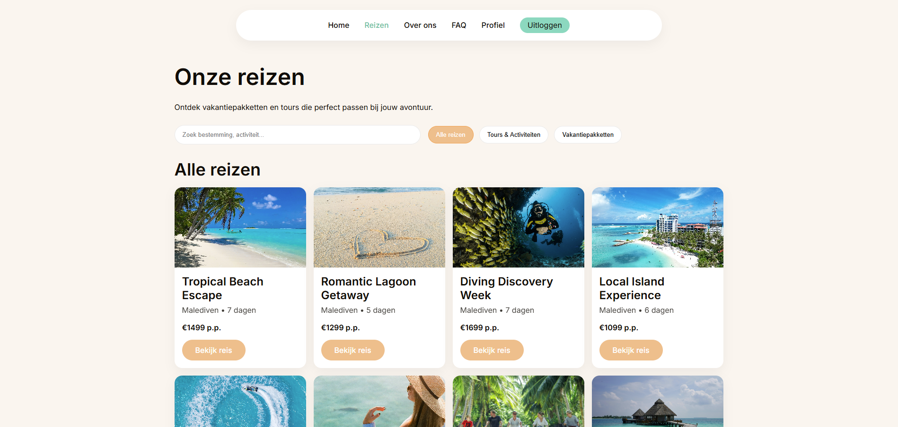

# Aurora Adventures — Maldives Travel Booking App

## Inhoudsopgave
- [Over dit project](#over-dit-project)
- [Belangrijkste functionaliteiten](#belangrijkste-functionaliteiten)
- [Screenshot](#screenshot)
- [Gebruikte technieken](#gebruikte-technieken)
- [Project lokaal draaien](#project-lokaal-draaien)
- [Inloggegevens](#inloggegevens)
- [Scripts](#scripts)
- [Belangrijk](#belangrijk)

## Over dit project
Aurora Adventures is een React webapplicatie waarmee gebruikers reizen naar de Malediven kunnen bekijken en boeken. Gebruikers kunnen een account aanmaken, inloggen, reizen bekijken, een boeking plaatsen en hun boekingen beheren via hun profiel.

Deze applicatie is ontwikkeld als eindopdracht voor de Front-End Development opleiding bij NOVI Hogeschool.

## Belangrijkste functionaliteiten
- Registreren en inloggen (authenticatie via NOVI Dynamic API)
- Reizenoverzicht met zoek- en filterfunctionaliteit
- Reisdetailpagina
- Boeking plaatsen
- Profielpagina met overzicht van eigen boekingen
- Boekingen verwijderen en aanpassen

## Screenshot


## Gebruikte technieken
- React (Vite)
- React Router (routing en protected routes)
- JavaScript (ES6+)
- CSS (component-gebaseerde styling)
- NOVI Dynamic API (authenticatie en projectdata)

## Project lokaal draaien
De applicatie draait lokaal met Node.js en npm en kan worden gestart met `npm run dev`. De applicatie is vervolgens bereikbaar via de URL die in de terminal wordt weergegeven, meestal `http://localhost:5173`.

Voor correcte werking maakt de applicatie gebruik van een `.env` bestand in de root van het project met de volgende variabelen:

```env
VITE_API_BASE_URL= vul hier de base url in die aangeleverd is in het .txt bestand
VITE_NOVI_PROJECT_ID= vul hier de project id in die aangeleverd is in het .txt bestand
```

## Inloggegevens

Gebruik onderstaande testaccount om de applicatie te beoordelen:

Testgebruiker

Email: user@auroraadventures.nl

Wachtwoord: User123!

Het is ook mogelijk om zelf een nieuw account te registreren binnen de applicatie.

## Scripts

`npm run dev` — start de development server

`npm run build` — maakt een productie-build

`npm run preview` — bekijkt de productie-build lokaal

## Belangrijk

Deze applicatie maakt gebruik van de NOVI Dynamic API.

Zonder een correct ingevuld .env bestand zal de applicatie niet functioneren.

De map node_modules is bewust niet meegeleverd in de inlever-zip.